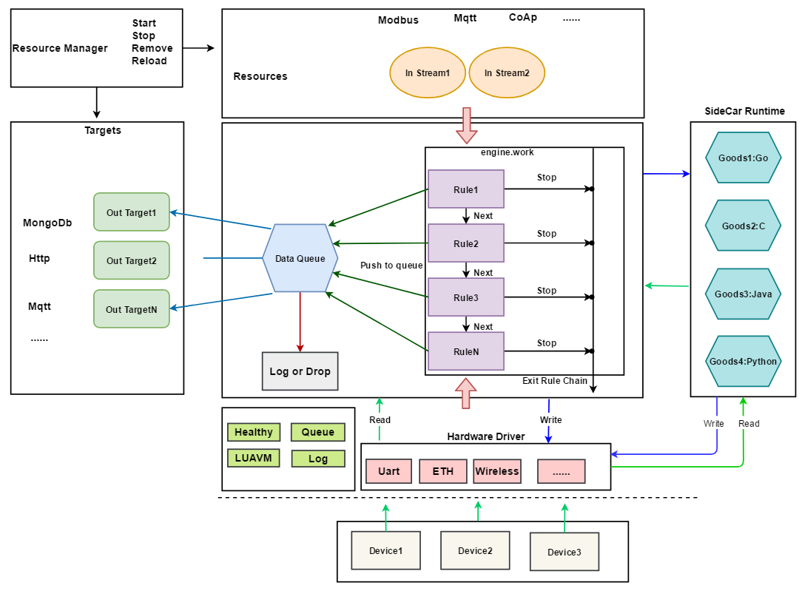

# RULEX Framework

**希望大家第一眼就看到这个说明 更多文档参考(国内可能需要科学上网): https://rulex.pages.dev**

### RULEX 是一个轻量级工业类边缘网关开发框架

## 架构设计

<div style="text-align:center">

</div>

## 快速开始

### HelloWorld
先看下面demo，顺便来开发你的第一个网关：
```go
package main

import (
	"os"
	"os/signal"
	"syscall"

	"github.com/i4de/rulex/core"
	"github.com/i4de/rulex/engine"
	"github.com/i4de/rulex/glogger"
	httpserver "github.com/i4de/rulex/plugin/http_server"

	"github.com/i4de/rulex/typex"
)

/*
*
* Test 485 sensor gateway
*
 */
func main() {
	mainConfig := core.InitGlobalConfig("rulex.ini")
	glogger.StartGLogger(true, core.GlobalConfig.LogPath)
	glogger.StartLuaLogger(core.GlobalConfig.LuaLogPath)
	core.StartStore(core.GlobalConfig.MaxQueueSize)
	core.SetLogLevel()
	core.SetPerformance()
	c := make(chan os.Signal, 1)
	signal.Notify(c, syscall.SIGINT, syscall.SIGABRT, syscall.SIGTERM)
	engine := engine.NewRuleEngine(mainConfig)
	engine.Start()

	hh := httpserver.NewHttpApiServer()

	// HttpApiServer loaded default
	if err := engine.LoadPlugin("plugin.http_server", hh); err != nil {
		glogger.GLogger.Fatal("Rule load failed:", err)
	}
	// RTU485_THER Inend
	RTU485Device := typex.NewDevice("RTU485_THER",
		"温湿度采集器", "温湿度采集器", "", map[string]interface{}{
			"slaverIds": []uint8{1, 2},
			"timeout":   5,
			"frequency": 5,
			"config": map[string]interface{}{
				"uart":     "/dev/ttyUSB0",
				"dataBits": 8,
				"parity":   "N",
				"stopBits": 1,
				"baudRate": 4800,
			},
			"registers": []map[string]interface{}{
				{
					"tag":      "node1",
					"function": 3,
					"slaverId": 1,
					"address":  0,
					"quantity": 2,
				},
				{
					"tag":      "node2",
					"function": 3,
					"slaverId": 2,
					"address":  0,
					"quantity": 2,
				},
			},
		})
	RTU485Device.UUID = "RTU485Device1"
	if err := engine.LoadDevice(RTU485Device); err != nil {
		glogger.GLogger.Error("RTU485Device load failed:", err)
	}
	mqttOutEnd := typex.NewOutEnd(
		"MQTT",
		"MQTT桥接",
		"MQTT桥接", map[string]interface{}{
			"Host":     "127.0.0.1",
			"Port":     1883,
			"ClientId": "test-485-thgw1",
			"Username": "test-485-thgw1",
			"Password": "test-485-thgw1",
			"PubTopic": "MQTT/upstream/test-485-thgw1",
			"SubTopic": "MQTT/downstream/test-485-thgw1",
		},
	)
	mqttOutEnd.UUID = "mqttOutEnd-MQTT"
	if err := engine.LoadOutEnd(mqttOutEnd); err != nil {
		glogger.GLogger.Fatal("mqttOutEnd load failed:", err)
	}
	rule := typex.NewRule(engine,
		"uuid",
		"数据推送至MQTT",
		"数据推送至MQTT",
		[]string{},
		[]string{RTU485Device.UUID}, // 数据来自网关设备,所以这里需要配置设备ID
		`function Success() print("[LUA Success Callback]=> OK") end`,
		`
Actions = {function(data)
	for tag, v in pairs(rulexlib:J2T(data)) do
		local ts = rulexlib:TsUnixNano()
		local value = rulexlib:J2T(v['value'])
		value['tag']= tag;
		local jsont = {
			method = 'report',
			requestId = ts,
			timestamp = ts,
			params = value
		}
		print('mqttOutEnd-MQTT', rulexlib:T2J(jsont))
		rulexlib:DataToMqtt('mqttOutEnd-MQTT', rulexlib:T2J(jsont))
	end
	return true, data
end}
`,
		`function Failed(error) print("[LUA Failed Callback]", error) end`)
	if err := engine.LoadRule(rule); err != nil {
		glogger.GLogger.Fatal(err)
	}
	s := <-c
	glogger.GLogger.Warn("Received stop signal:", s)
	engine.Stop()
	os.Exit(0)
}
```
上面是一个完整的温湿度传感器数据操作的demo，其主要实现了modbus两个寄存器读写，然后数据上mqtt服务器。如果你觉得麻烦，你可以试试我提前准备好的模板项目:
```sh
git clone https://github.com/wwhai/rulex-base-template.git
cd rulex-base-template
make **
```
当然这仅仅是个模板，你可以随便扩充其功能。

## 支持的平台

| 平台  | 架构   | 编译测试 |
| ----- | ------ | -------- |
| Linux | X86-64 | 通过     |
| ARM64 | ARM-64 | 通过     |
| ARM32 | ARM-32 | 通过     |
| MacOS | X86-64 | 通过     |
| 其他  | 未知   | 未知     |

## 规则引擎

### 规则定义

```lua

function Success()
    -- do some things
end

function Failed(error)
    -- do some things
end

Actions = {
    function(data)
        return true, data
    end
}

```

### 数据筛选

```lua
Actions = {
    function(data)
        print("return => ", rulexlib:JqSelect(".[] | select(.hum < 20)", data))
        return true, data
    end
}
```

### 数据中转

```lua
Actions = {
    function(data)
        -- 持久化到 MongoDb:
        rulexlib:DataToMongo("45dd0c90f56d", data)
        -- 持久化到 Mysql:
        rulexlib:DataToMysql("45dd0c90f56d", data)
        -- 推送化到 Kafka:
        rulexlib:DataToKafka("45dd0c90f56d", data)
        return true, data
    end
}
```

### 云端计算

```lua
Actions = {
    function(data)
        -- PyTorch 训练数据:
        cloud:PyTorchTrainCNN(data)
        -- PyTorch 识别:
        local V = cloud:PyTorchCNN(data)
        print(V)
        return true, data
    end
}
```
> 如果您阅读过 RULEX 的源码，你会发现里面有很多很愚蠢的设计（比如对资源的状态管理、类型硬编码设计等），因为特殊历史原因导致了其设计上有一些很糟粕的地方，如有建议请不吝赐教，一起让这个框架更加优秀！同时未来随着版本的迭代，很多低级问题会逐步被重构完善。

## 社区

- QQ群：608382561
- 文档: <a href="https://rulex.pages.dev">[点我查看详细文档]</a>
- 微信：nilyouth( 加好友后进群, 别忘了来个小星星, 暗号：RULEX )
  <div style="text-align:center">
    
  </div>
- 博客1：https://wwhai.gitee.io
- 博客2：https://wwhai.github.io

## 贡献者
鸣谢各位给RULEX贡献代码的大佬。

### RULEX
<a href="https://github.com/i4de/rulex/graphs/contributors">
  
</a>

### RULEX Other
<a href="https://github.com/i4de/rulex-dashboard/graphs/contributors">
  
</a>

## Star

