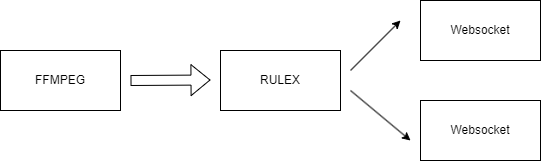

<!--
 Copyright (C) 2023 wwhai

 This program is free software: you can redistribute it and/or modify
 it under the terms of the GNU Affero General Public License as
 published by the Free Software Foundation, either version 3 of the
 License, or (at your option) any later version.

 This program is distributed in the hope that it will be useful,
 but WITHOUT ANY WARRANTY; without even the implied warranty of
 MERCHANTABILITY or FITNESS FOR A PARTICULAR PURPOSE.  See the
 GNU Affero General Public License for more details.

 You should have received a copy of the GNU Affero General Public License
 along with this program.  If not, see <http://www.gnu.org/licenses/>.
-->

# FFMPEG推流器
主要用来向前端推RTSP流，拉流用FFMPEG指令实现，本质是执行一个长命令，用 golang 的 Process 实现。

指令如下：

```sh
ffmpeg -rtsp_transport tcp -re -i rtsp://192.168.199.243:554/av0_0 -q 5 -f mpegts -fflags nobuffer -c:v mpeg1video -an -s 1920x1080 http://127.0.0.1:9400/stream/ffmpegPush?liveId=147a6d7ae5a785f6e3ea90f25d36c63e
```
## 原理
