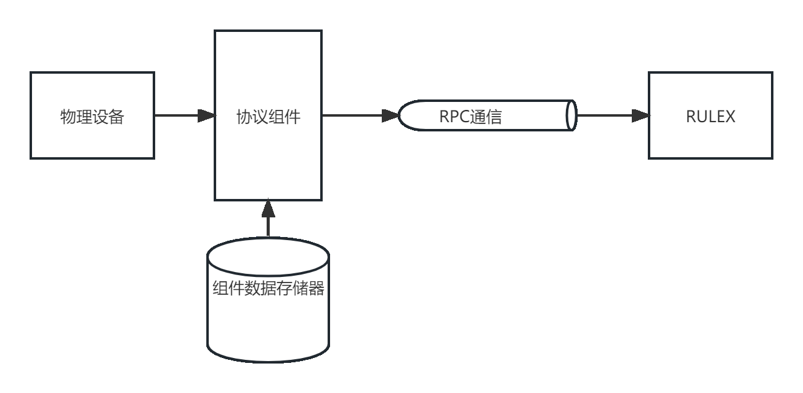

<!--
 Copyright (C) 2023 wwhai

 This program is free software: you can redistribute it and/or modify
 it under the terms of the GNU Affero General Public License as
 published by the Free Software Foundation, either version 3 of the
 License, or (at your option) any later version.

 This program is distributed in the hope that it will be useful,
 but WITHOUT ANY WARRANTY; without even the implied warranty of
 MERCHANTABILITY or FITNESS FOR A PARTICULAR PURPOSE.  See the
 GNU Affero General Public License for more details.

 You should have received a copy of the GNU Affero General Public License
 along with this program.  If not, see <http://www.gnu.org/licenses/>.
-->

# 简介
Trailer就是拖车,带着小车一起跑,比喻了Trailer实际上是个进程管理器。在RULEX里面这个概念用来和外部的异构端进行交互，其内部原理用RPC实现。

Trailer主要用来做三方开发对接使用。比如有新设备的协议是保密或者不公开的，只提供了一套规范，此时就可以用Trailer概念来加载这个规范进来。Trailer主要针对的是设备的协议对接和开发者。开发者开发RPC协议的时候，直接规范好自己的表以及行定义，RULEX和组件交互的时候，会问他要他的规范。RULEX的用户级接口实际上就是在调用RPC的接口，权限由开发者完全控制。
## 开发
可参考这两个示例
- Java: https://github.com/hootrhino/trailer-java-app
- Golang: https://github.com/hootrhino/trailer-go-app