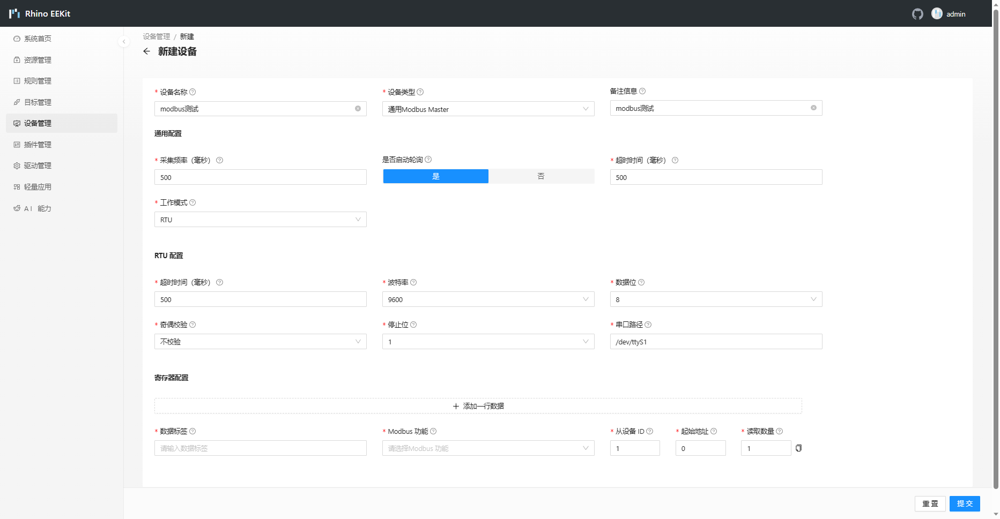
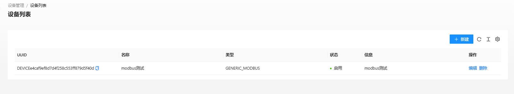
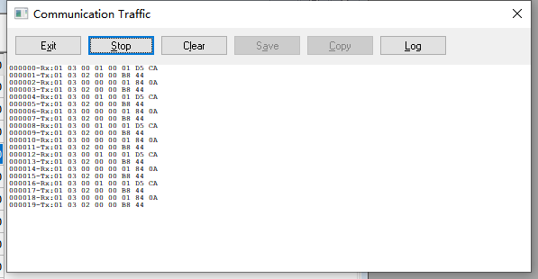
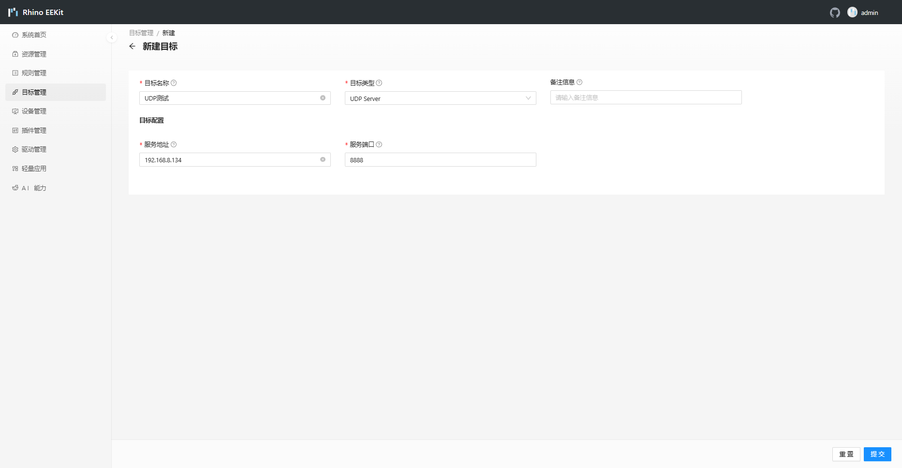
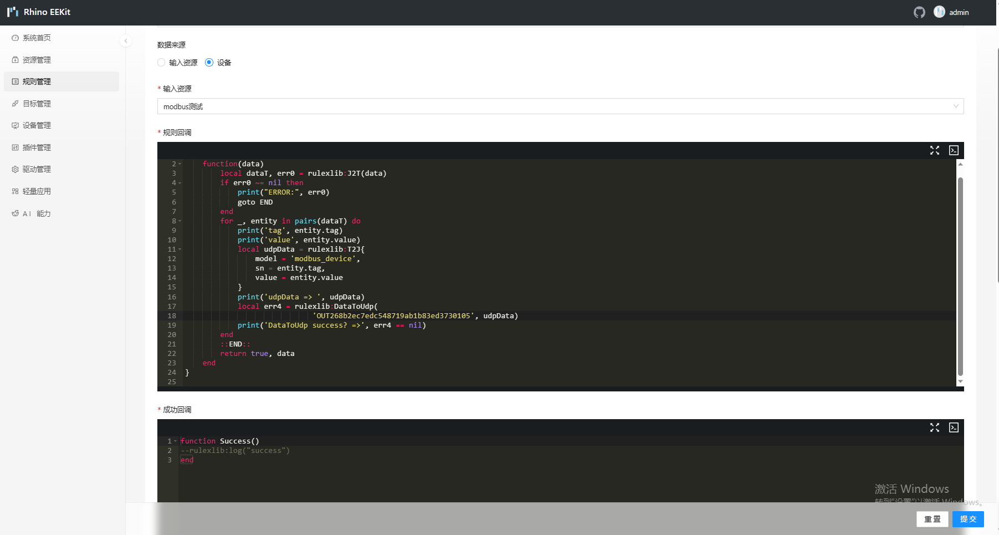
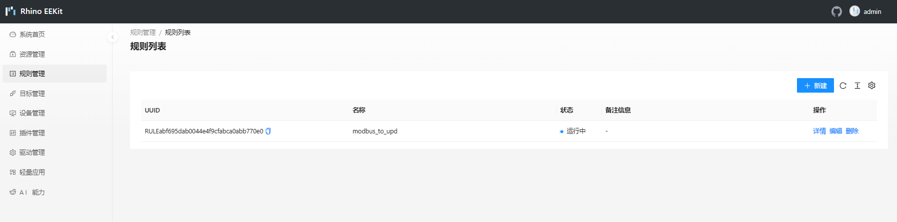

# Modbus 通用采集器


## 简介
Modbus是一种通信协议，常用于工业自动化领域，用于在控制设备之间进行数据交换。它定义了一组规则和格式，以便不同的设备可以相互通信并共享数据。Modbus协议支持多种物理层，包括串口（如RS-232、RS-485）、以太网等。
Modbus协议有三种常用的变体：

1. Modbus RTU（Remote Terminal Unit）：在串口上使用二进制形式进行通信，每个数据帧由起始位、从站地址、功能码、数据字段、校验位和终止位组成。

2. Modbus ASCII（American Standard Code for Information Interchange）：在串口上使用ASCII码进行通信，每个数据帧由起始字符“:”、从站地址、功能码、数据字段、校验和和终止字符“CR LF”组成。

3. Modbus TCP（Transmission Control Protocol）：在以太网上使用TCP/IP协议进行通信，数据帧以TCP报文的形式进行传输。Modbus TCP使用标准的Modbus数据格式，但在以太网上通过封装在TCP/IP报文中来实现。

Modbus协议定义了一组功能码（Function Code），用于指示设备执行不同的操作。常见的功能码包括读取寄存器值、写入寄存器值、读取输入状态等。
Modbus协议是一种简单且易于实现的协议，广泛应用于工业自动化中的监控和控制系统。它允许不同的设备（如传感器、执行器、PLC等）通过标准化的通信方式进行数据交换，实现设备之间的协作和集成。

本插件是一个通用 Modbus 资源，可以用来实现常见的 modbus 协议寄存器读写等功能，当前版本只支持TCP和RTU模式。

## 快速开始

### 1.准备

案例用到的硬件设施
- 网关主板
- PC：用于调试
- USB转485工具：案例中用了两个USB转485工具

案例用到的软件设施
- modbus slave：用于模拟modbus客户端软件
- Edge浏览器：用于对EEKIT进行配置、数据查看
- UDP服务器软件：接收EEKIT转发的数据

### 2.modbus slave软件配置


案例中使用的是modbus rtu，通过USB转485工具将PC和RK3288 485连接起来，这里根据实际情况选择串口


正确连接情况如图

### 3.配置modbus rtu轮询

#### (1)新建设备


#### (2)填写基本配置



案例中，采集频率位500毫秒，其中超时时间均设置为500毫秒 ，开启自动轮询后，会自动轮询下发指令。

串口路径为`/dev/ttyS1`，这里根据自身情况更改串口路径，串口路径不能写错，其他串口相关信息，根据自身情况而定

#### (3)填写寄存器配置


数据标签是最终根据规则转发出去数据标签，modbus功能为modbus指令，目前版本暂时只能读，填写后，点击提交



如果这个时候我们正确接入，状态会显示启用，如果出错状态会显示故障，正确结果如图所示



### 4.目标配置

#### (1)新建目标


#### (2)填写目标信息



案例中是将modbus读取回来的数据推向UDP服务器


#### 5.规则管理

#### (1)新建规则


#### (2)填写基础信息


这里规则必须先选择对应设备，如果是输入资源的规则那么就选择输入规则，选择后，开始编写lua规则脚本

#### (3)编写lua规则脚本

脚本如下：
```lua
Actions = {
  function(args)
​    local dataT, err0 = rulexlib:J2T(data)
​    if err0 ~= nil then
​      print("ERROR:", err0)
​      goto END
​    end
​    for _, entity in pairs(dataT) do
​      print('tag', entity.tag)
​      print('value', entity.value)
​      local udpData = rulexlib:T2J{
​        model = 'modbus_device',
​        sn = entity.tag,
​        value = entity.value
​      }
​      print('udpData => ', udpData)
​      local err4 = data:ToUdp(
​               'OUT268b2ec7edc548719ab1b83ed3730105', udpData)
​      print('DataToUdp success? =>', err4 == nil)
​    end
​    ::END::
​    return true, args
  end
}

```
输出资源为上图配置的UDP输出资源UUID



配置的规则代码如图，单击提交



#### (4)UDP工具查看数据


成功收到数据，本例PC有两个IP，实际是真实IP地址

## 数据样例
Modbus采集器采集出来的数据是一个大Map结构。
```json
{
    "d1":{
        "tag":"d1",
        "function":3,
        "slaverId":1,
        "address":0,
        "quantity":6,
        "value":"0117011d0127011a0110010e"
    }
}
```
- value: 十六进制字符串


## 维护
- <liyong@gmail.com>
