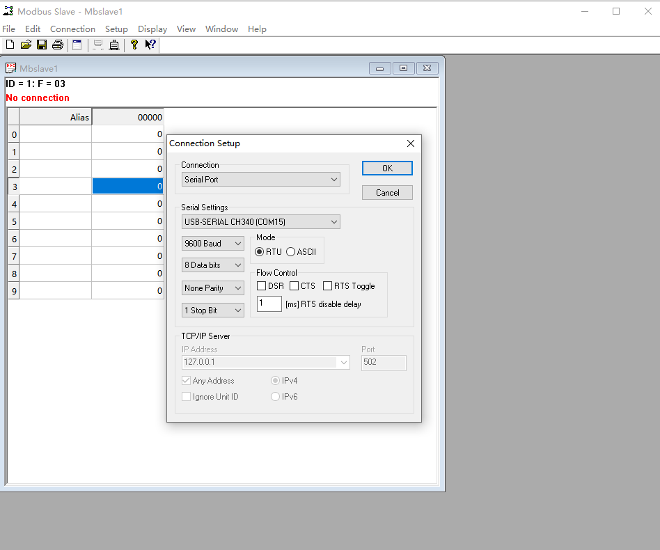
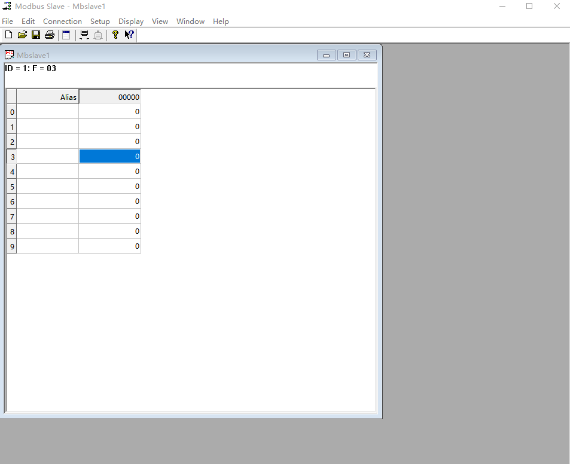
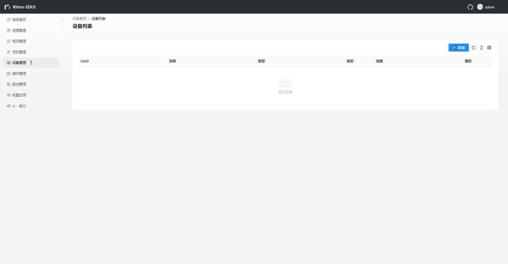
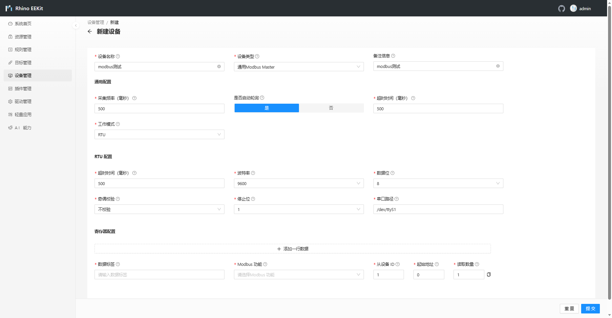
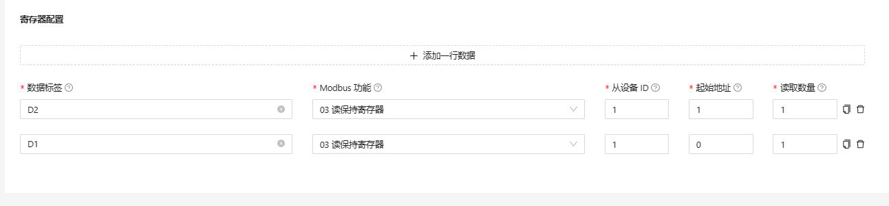
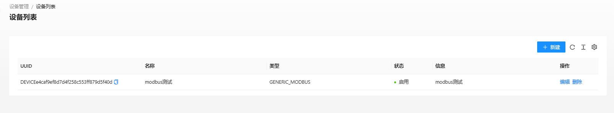
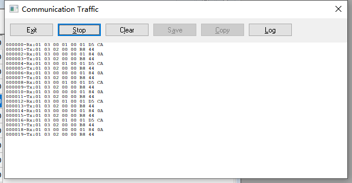
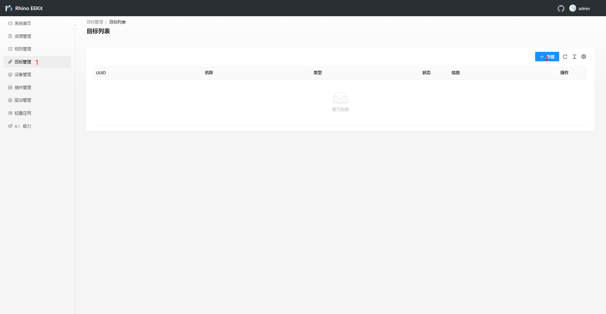
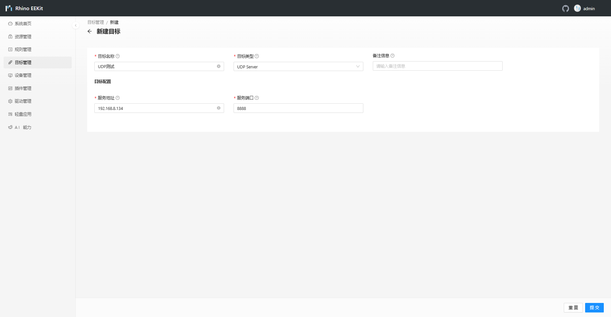
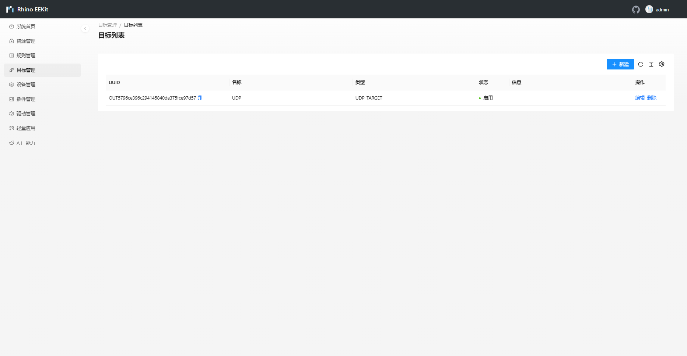

# Modbus 通用采集器
Modbus是一种通信协议，常用于工业自动化领域，用于在控制设备之间进行数据交换。它定义了一组规则和格式，以便不同的设备可以相互通信并共享数据。Modbus协议支持多种物理层，包括串口（如RS-232、RS-485）、以太网等。
Modbus协议有三种常用的变体：

1. Modbus RTU（Remote Terminal Unit）：在串口上使用二进制形式进行通信，每个数据帧由起始位、从站地址、功能码、数据字段、校验位和终止位组成。

2. Modbus ASCII（American Standard Code for Information Interchange）：在串口上使用ASCII码进行通信，每个数据帧由起始字符“:”、从站地址、功能码、数据字段、校验和和终止字符“CR LF”组成。

3. Modbus TCP（Transmission Control Protocol）：在以太网上使用TCP/IP协议进行通信，数据帧以TCP报文的形式进行传输。Modbus TCP使用标准的Modbus数据格式，但在以太网上通过封装在TCP/IP报文中来实现。

Modbus协议定义了一组功能码（Function Code），用于指示设备执行不同的操作。常见的功能码包括读取寄存器值、写入寄存器值、读取输入状态等。
Modbus协议是一种简单且易于实现的协议，广泛应用于工业自动化中的监控和控制系统。它允许不同的设备（如传感器、执行器、PLC等）通过标准化的通信方式进行数据交换，实现设备之间的协作和集成。

## 简介

本插件是一个通用 Modbus 资源，可以用来实现常见的 modbus 协议寄存器读写等功能，当前版本只支持TCP和RTU模式。

## 快速开始

### 1.准备

案例用到的硬件设施

RK3288主板：网关主板

PC：用于调试

USB转485工具：案例中用了两个USB转485工具

案例用到的软件设施

modbus slave：用于模拟modbus客户端软件

Edge浏览器：用于对EEKIT进行配置、数据查看

UDP服务器软件：接收EEKIT转发的数据

### 2.modbus slave软件配置



案例中使用的是modbus rtu，通过USB转485工具将PC和RK3288 485连接起来，这里根据实际情况选择串口



正确连接情况如图

### 3.配置modbus rtu轮询

#### (1)新建设备



#### (2)填写基本配置



案例中，采集频率位500毫秒，其中超时时间均设置为500毫秒 ，开启自动轮询后，会自动轮询下发指令。

串口路径为/dev/ttyS1，这里根据自身情况更改串口路径，串口路径不能写错，其他串口相关信息，根据自身情况而定

#### (3)填写寄存器配置



数据标签是最终根据规则转发出去数据标签，modbus功能为modbus指令，目前版本暂时只能读，填写后，点击提交



如果这个时候我们正确接入，状态会显示启用，如果出错状态会显示故障，正确结果如图所示



### 4.目标配置

#### (1)新建目标



#### (2)填写目标信息



案例中是将modbus读取回来的数据推向UDP服务器



#### 5.规则管理


## 数据样例
Modbus采集器采集出来的数据是一个大Map结构。
```json
{
    "d1":{
        "tag":"d1",
        "function":3,
        "slaverId":1,
        "address":0,
        "quantity":6,
        "value":"0117011d0127011a0110010e"
    }
}
```

- value: 十六进制字符串

## 常用函数

为了更加清楚的描述接口的使用，下面给出数据解析详细示例，主要用来实现采集数据保存到MongoDb：
```lua
Actions =
{
    function(data)
        local dataT, err = rulexlib:J2T(data)
        if (err ~= nil) then
            print('parse json error:', err)
            return true, data
        end
        for key, value in pairs(dataT) do
            local MatchHexS = rulexlib:MatchUInt("temp:[0,1];hum:[2,3]", value['value'])
            local ts = rulexlib:TsUnixNano()
            local Json = rulexlib:T2J(
                {
                    method = 'report',
                    clientToken = ts,
                    timestamp = 1677762028638,
                    params = {
                        tag = key,
                        temp = MatchHexS['temp'],
                        hum = MatchHexS['hum'],
                    }
                }
            )
            print("DataToMongoDB ->:", Json)
            print(rulexlib:DataToMqtt('OUT57c90e4cf8484a4caa43f5888c906cdb', Json))
        end
        return true, data
    end
}
```

## 


## 转发

## 维护

开源参与者需要给出维护作者的邮箱，方便及时处理问题。

- <liyong@gmail.com>
