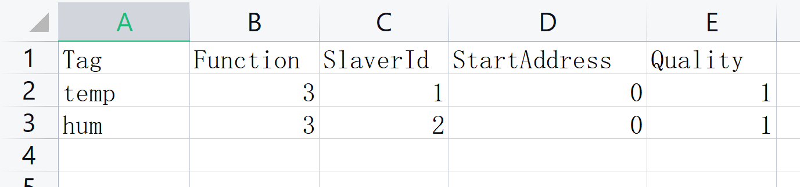

# Modbus点表导入支持

## 1. Modbus上传Excel点位文件

### 接口说明

| URL                                            | request | version | status |
| :--------------------------------------------- | :------ | :------ | :----- |
| http://server_ip/v1/devices/modbus/sheetImport | POST    | 1.0     | true   |

### 请求参数说明

注意：请求content-type是multipart/form-data

| 请求参数   | 类型   | 必填 | 必填                        |
| :--------- | :----- | :--- | :-------------------------- |
| deviceUuid | String | true | 设备UUID                    |
| file       | file   | true | 点位excel文件（具体看模板） |

Excel 模板

### 请求响应示例JSON
响应示例

```json
{
  "code": 200,
  "msg": "Success",
  "data": {}
}
```

## 2. 更新点位数据
### 接口说明

| URL                                              | request | version | status |
| :----------------------------------------------- | :------ | :------ | :----- |
| http://192.168.2.58:8080/v1/devices/modbus/point | PUT     | 1.0     | true   |

### 请求参数说明

注意：请求content-type是multipart/form-data

| 请求参数     | 类型   | 必填 | 备注                  |
| :----------- | :----- | :--- | :-------------------- |
| Id           | int    | true | 点位ID                |
| DeviceUuid   | file   | true | 设备UUID              |
| Tag          | String | true | 数据标签              |
| Function     | int    | true | Modbus功能            |
| SlaverId     | int    | true | 从设备ID    （1-255） |
| StartAddress | int    | true | 起始地址              |
| Quality      | int    | true | 偏移量（双字节）      |

### 请求示例JSON
```json
{
    "id": 1,
    "deviceUuid": "uuid",
    "tag": "tag",
    "function": "1",
    "slaverId": 1,
    "StartAddress": 2,
    "Quality": 1
}
```

### 返回示例JSON
```json
{
    "code": 200,
    "msg": "Success",
    "data": {}
}
```

## 3. 获取点位数据

### 接口说明

| URL                                              | request | version | status |
| :----------------------------------------------- | :------ | :------ | :----- |
| http://192.168.2.58:8080/v1/devices/modbus/point | GET     | 1.0     | true   |

### 请求参数说明

注意：请求content-type是multipart/form-data

| 请求参数   | 类型 | 必填 | 必填     |
| :--------- | :--- | :--- | :------- |
| DeviceUuid | file | true | 设备UUID |

### 请求示例JSON
```json
{
    "deviceUuid": "uuid"
}
```

### 返回示例JSON
```json
{
    "code": 200,
    "msg": "Success",
    "data": [{
      "id": 1,
      "deviceUuid": "uuid",
      "tag": "tag",
      "function": "1",
      "slaverId": 1,
      "startAddress": 2,
      "quality": 1,
      "createdAt": "2023-08-22 18:00:00"
    }]
}
```