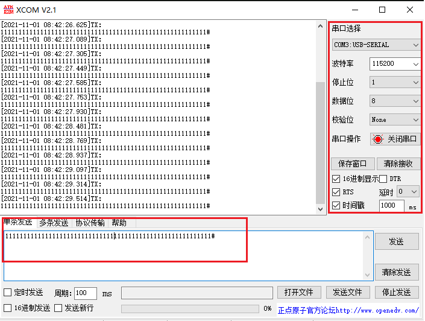

# 注意
这个目录下的文件是专门针对树莓派开发的一些模块，在不同的硬件上需要调整规范，并不通用。
## 生成序列号
这是一段测试代码，用来生成序列号，一般情况下建议写到数据库里面。
```c
#include <stdio.h>
#include <stdlib.h>
#include <time.h>
int main(int argc, char const *argv[])
{
    FILE *fp = NULL;
    fp = fopen("serial_number.csv", "w");
    if (fp == NULL)
    {
        printf("file can't be opened\n");
        exit(1);
        return 0;
    }
    srand((unsigned)time(NULL));
    fprintf(fp, "Address , Channel\n");
    for (size_t i = 1; i < 0xFF; i++)
    {
        fprintf(fp, "%d , %d\n", i, rand() % 0xFFFF + 10000);
    }
    fclose(fp);
    return 0;
}

```
## 创建一个Lora模块
Config:
```json
{
    "name": "UART_MODULE",
    "type": "UART_MODULE",
    "config": {
        "address": "COM2",
        "baudRate": 115200,
        "timeout": 3,
        "dataBits": 8,
        "parity": "N",
        "stopBits": 1
    },
    "description": "UART_MODULE"
}
```
Test:

```sh
rulexc inend-create --config  '{
    "name": "UART_MODULE",
    "type": "UART_MODULE",
    "config": {
        "address": "COM2",
        "baudRate": 115200,
        "timeout": 3,
        "dataBits": 8,
        "parity": "N",
        "stopBits": 1
    },
    "description": "UART_MODULE"
}'
```
## 模拟串口测试
### 安装 socat
```
sudo apt install socat
```
### 运行
```sh
socat -d -d -d  pty,raw,echo=0 pty,raw,echo=1
```
### 输出
```
2021/09/11 19:18:03 socat[6074] I socat by Gerhard Rieger and contributors - see www.dest-unreach.org
2021/09/11 19:18:03 socat[6074] I This product includes software developed by the OpenSSL Project for use in the OpenSSL Toolkit. (http://www.openssl.org/)
2021/09/11 19:18:03 socat[6074] I This product includes software written by Tim Hudson (tjh@cryptsoft.com)
2021/09/11 19:18:03 socat[6074] I setting option "raw"
2021/09/11 19:18:03 socat[6074] I setting option "echo" to 0
2021/09/11 19:18:03 socat[6074] I openpty({5}, {6}, {"/dev/pts/0"},,) -> 0
2021/09/11 19:18:03 socat[6074] N PTY is /dev/pts/0
2021/09/11 19:18:03 socat[6074] I setting option "raw"
2021/09/11 19:18:03 socat[6074] I setting option "echo" to 1
2021/09/11 19:18:03 socat[6074] I openpty({7}, {8}, {"/dev/pts/1"},,) -> 0
2021/09/11 19:18:03 socat[6074] N PTY is /dev/pts/1

```

## 关键输出
```
2021/09/11 19:18:03 socat[6074] N PTY is /dev/pts/0
2021/09/11 19:18:03 socat[6074] N PTY is /dev/pts/1
```
标识开启了两个模拟串口:

- `/dev/pts/0`
- `/dev/pts/1`

一个用来发送，一个用来接收。

## 测试软件


## 如何实现一个驱动
只需实现下面的接口即可,具体可看串口驱动：

```go
type XExternalDriver interface {
	Test() error
	Init() error
	Work() error
	State() DriverState
	Read([]byte) (int, error)
	Write([]byte) (int, error)
	DriverDetail() *DriverDetail
	Stop() error
}

```
