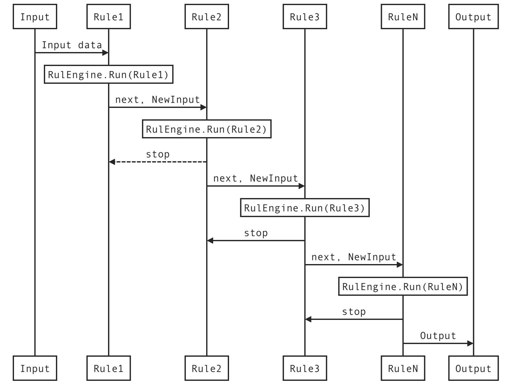

# RulEngineX
A simple and lightweight stream data processor.

---

## Architecture



---

## InEnd
```go
type inEnd struct {
	Id          string                  `json:"id"`
	State       TargetState             `json:"state"`
	Type        string                  `json:"type"`
	Name        string                  `json:"name"`
	Description string                  `json:"description"`
	Binds       *map[string]rule        `json:"-"`
	Config      *map[string]interface{} `json:"config"`
}
//
type XResource interface {
	Test(inEndId string) bool
	Register(inEndId string) error
	Start(e *RuleEngine) error
	Enabled() bool
	Reload()
	Pause()
	Status(e *RuleEngine) TargetState
	Stop()
}

```
---

## OutEnd
```go
type outEnd struct {
	Id          string                  `json:"id"`
	Type        string                  `json:"type"`
	State       TargetState             `json:"state"`
	Name        string                  `json:"name"`
	Description string                  `json:"description"`
	Config      *map[string]interface{} `json:"config"`
	Target      XTarget                 `json:"-"`
}
//
type XTarget interface {
	Test(outEndId string) bool
	Register(outEndId string) error
	Start(e *RuleEngine) error
	Enabled() bool
	Reload()
	Pause()
	Status(e *RuleEngine) TargetState
	To(data interface{}) error
	Stop()
}
```
---

## Plugin
```go
type XPlugin interface {
	Load(*RuleEngine) *XPluginEnv
	Init(*XPluginEnv) error
	Install(*XPluginEnv) (*XPluginMetaInfo, error)
	Start(*RuleEngine, *XPluginEnv) error
	Uninstall(*XPluginEnv) error
	Clean()
}

```
## Life Cycle
```
Load -> Init -> Install -> Start -> Uninstall -> Clean
```
---

## WebApi Plugin Demo
```go
package plugin

const API_ROOT string = "/api/v1/"
const DASHBOARD_ROOT string = "/dashboard/v1/"

type HttpApiServer struct {
	ginEngine  *gin.Engine
	RuleEngine *x.RuleEngine
}

func (hh *HttpApiServer) Load(r *x.RuleEngine) *x.XPluginEnv {
	hh.ginEngine = gin.New()
	gin.SetMode(gin.ReleaseMode)
	hh.ginEngine.LoadHTMLGlob("plugin/templates/*")
	hh.RuleEngine = r
	return x.NewXPluginEnv()
}

//
func (hh *HttpApiServer) Init(env *x.XPluginEnv) error {
	ctx := context.Background()
	go func(ctx context.Context) {
		hh.ginEngine.Run(":2580")
	}(ctx)
	return nil
}
func (hh *HttpApiServer) Install(env *x.XPluginEnv) (*x.XPluginMetaInfo, error) {
	return &x.XPluginMetaInfo{
		Name:     "HttpApiServer",
		Version:  "0.0.1",
		Homepage: "www.ezlinker.cn",
		HelpLink: "www.ezlinker.cn",
		Author:   "wwhai",
		Email:    "cnwwhai@gmail.com",
		License:  "MIT",
	}, nil
}

//
//
func (hh *HttpApiServer) Start(e *x.RuleEngine, env *x.XPluginEnv) error {
	hh.ginEngine.GET(DASHBOARD_ROOT, func(c *gin.Context) {
		c.HTML(http.StatusOK, "dashboard.html", gin.H{})
	})
	hh.ginEngine.GET(API_ROOT+"system", func(c *gin.Context) {
		cros(c)
		//
		percent, _ := cpu.Percent(time.Second, false)
		memInfo, _ := mem.VirtualMemory()
		parts, _ := disk.Partitions(true)
		diskInfo, _ := disk.Usage(parts[0].Mountpoint)
		c.JSON(http.StatusOK, gin.H{
			"diskInfo":   diskInfo.UsedPercent,
			"memInfo":    memInfo.UsedPercent,
			"cpuPercent": percent[0],
			"os":         runtime.GOOS,
			"arch":       runtime.GOARCH,
			"cpus":       runtime.GOMAXPROCS(0)})
	})
	log.Info("Http web dashboard started on:http://127.0.0.1:2580" + DASHBOARD_ROOT)
	return nil
}

func (hh *HttpApiServer) Uninstall(env *x.XPluginEnv) error {
	log.Info("HttpApiServer Uninstalled")
	return nil
}
func (hh *HttpApiServer) Clean() {
	log.Info("HttpApiServer Cleaned")
}

```
