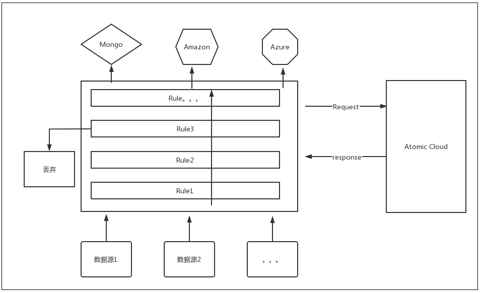
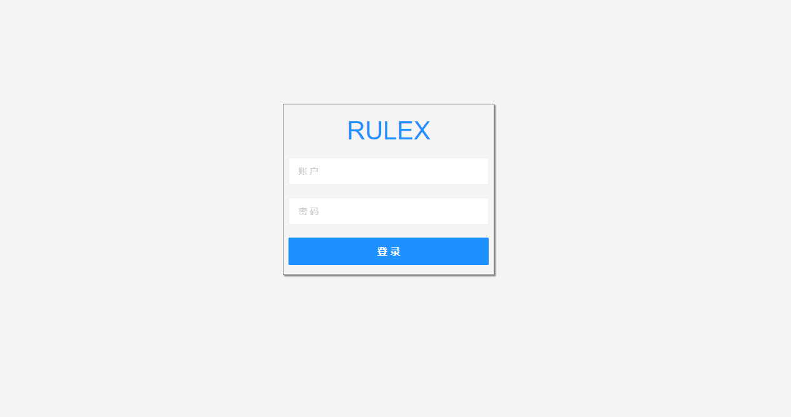
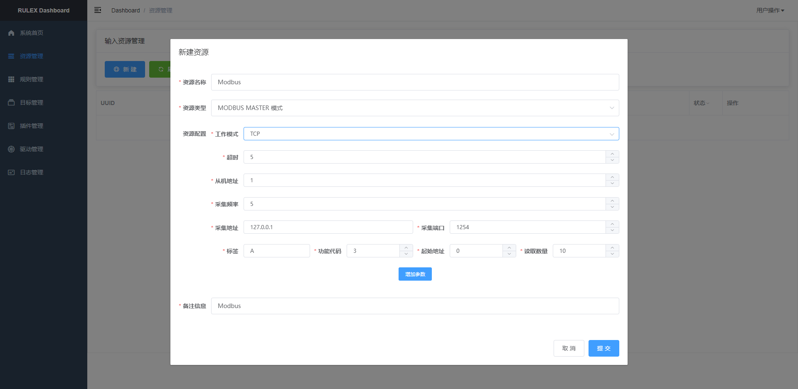
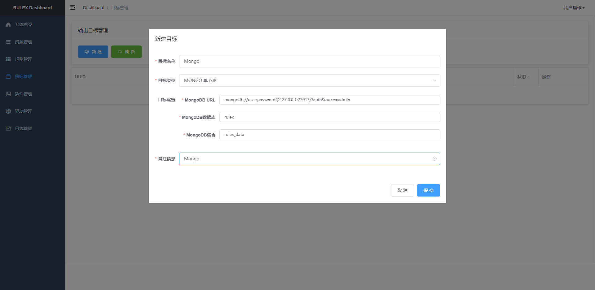
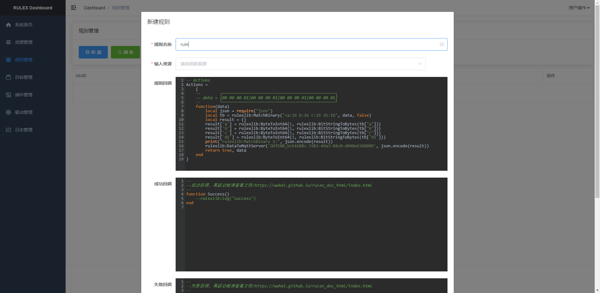

# RuleX

RuleX 是一个轻量级网关，支持多种数据接入以及数据流筛选，可以理解为一个数据路由器。

> 当前处于极其不稳定阶段,请勿尝试.
## 预览
### 架构

### 登录

### 首页

### 服务

### 资源


## 快速开始
### 构建
```sh
git clone https://github.com/wwhai/rulex.git
cd rulex
make # on windows: make windows
```
> ProtoFile需要在Linux下编译, 需要安装: `sudo apt install protobuf-compiler -y`
## 支持的平台

| 平台    | 架构   | 编译测试 |
| ------- | ------ | -------- |
| Windows | X86-64 | 通过     |
| Linux   | X86-64     | 通过     |
| ARM64   | ARM-64 | 通过     |
| ARM32   | ARM-32 | 通过     |
| MacOS   | X86-64     | 通过     |
| 其他    | 未知   | 未知     |

> 注意:` Arm32位`下编译比较麻烦，推荐使用`Ubuntu18-04`安装交叉编译工具进行编译:
>
> ```sh
> apt-get update && \
> apt-get upgrade -y && \
>     apt-get install -y \
>       build-essential \
>       git \
>       zip \
>       make \
>       gcc-arm-linux-gnueabi \
>       bzip2 \
>       wget && \
>     apt-get clean
> 
> git clone https://gitee.com/wwhai/rulex.git
> cd rulex
> CC=arm-linux-gnueabi-gcc GOARM=7 GOARCH=arm GOOS=linux CGO_ENABLED=1 go build -v -o arm32 -ldflags "-linkmode external -extldflags -static" main.go
> 
> ```
>
> 

### 启动

```sh
./rulex run ./conf/default.data
2021/09/20 17:09:05 cfg.go:24: [info] Init rulex config 
2021/09/20 17:09:05 cfg.go:34: [info] Rulex config init success. 
2021/09/20 17:09:05 utils.go:71: [info] 
 -----------------------------------------------------------     
~~~/=====\       ██████╗ ██╗   ██╗██╗     ███████╗██╗  ██╗       
~~~||\\\||--->o  ██╔══██╗██║   ██║██║     ██╔════╝╚██╗██╔╝       
~~~||///||--->o  ██████╔╝██║   ██║██║     █████╗   ╚███╔╝        
~~~||///||--->o  ██╔══██╗██║   ██║██║     ██╔══╝   ██╔██╗        
~~~||\\\||--->o  ██║  ██║╚██████╔╝███████╗███████╗██╔╝ ██╗       
~~~\=====/       ╚═╝  ╚═╝ ╚═════╝ ╚══════╝╚══════╝╚═╝  ╚═╝
-----------------------------------------------------------
2021/09/20 17:09:05 utils.go:74: [info] rulex start successfully
2021/09/20 17:09:05 http_api_server.go:139: [info] Http server started on http://127.0.0.1:2580
2021/09/20 17:09:05 grpc_resource.go:92: [info] RulexRpc resource started on [::]:2581
2021/09/20 17:09:05 coap_resource.go:71: [info] Coap resource started on [udp]:2582
2021/09/20 17:09:05 http_resource.go:47: [info] HTTP resource started on [0.0.0.0]:2583
2021/09/20 17:09:05 udp_resource.go:50: [info] UDP resource started on [0.0.0.0]:2584
```
> `./conf/default.data` 是已经设置好的测试数据,方便大家调试体验，你可以直接运行:`./rulex run`
## Dashboard
```
浏览器输入：http://127.0.0.1:2580
```

## HTTP API
## 规则引擎
### 规则定义
```lua

function Success()
    -- do some things
end

function Failed(error)
    -- do some things
end

Actions = {
    function(data)
        return true, data
    end
}

```

### 数据筛选
```lua
function Success()
    -- do some things
end

function Failed(error)
    -- do some things
end

Actions = {
    function(data)
        print("return => ", stdlib:JqSelect(".[] | select(.hum < 20)", data))
        return true, data
    end
}
```
### 数据中转

```lua
function Success()
    -- do some things
end

function Failed(error)
    -- do some things
end

Actions = {
    function(data)
        -- 持久化到 MongoDb:
        stdlib:DataToMongo("OUTEND_83775a94-9f64-4d37-be17-45dd0c90f56d", data)
        -- 持久化到 Mysql:
        stdlib:DataToMysql("OUTEND_83775a94-9f64-4d37-be17-45dd0c90f56d", data)
        -- 推送化到 Kafka:
        stdlib:DataToKafka("OUTEND_83775a94-9f64-4d37-be17-45dd0c90f56d", data)
        return true, data
    end
}
```
### 云端计算
```lua
function Success()
    -- do some things
end

function Failed(error)
    -- do some things
end

Actions = {
    function(data)
        -- PyTorch 训练数据:
        cloud:PyTorchTrainCNN(data)
        -- PyTorch 识别:
        local V = cloud:PyTorchCNN(data)
        print(V)
        return true, data
    end
}
```

## 未来计划

- 完整支持常见的物联网协议接入
- 完整支持常见数据的输出
- 提供压测数据以及构建发布包

预计于: 2022年1月1日发布第一个正式版，敬请期待。

## 详细文档

<div style="text-align:center;">
    <a href="https://wwhai.github.io/rulex_doc_html">[点我查看详细文档]</a>
<div>

