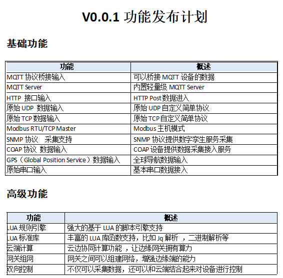

# RuleX

RuleX 是一个轻量级网关, 支持多种数据接入以及数据流筛选, 可以理解为一个数据路由器。

> 当前处于极其不稳定阶段, 每天都会有大批量更新, 请勿尝试用于生产.

## 快速开始
### 构建
```sh
git clone https://github.com/wwhai/rulex.git
cd rulex
make # on windows: make windows
```
> ProtoFile需要在Linux下编译, 需要安装: `sudo apt install protobuf-compiler -y`
## 支持的平台

| 平台    | 架构   | 编译测试 |
| ------- | ------ | -------- |
| Windows | X86-64 | 通过     |
| Linux   | X86-64 | 通过     |
| ARM64   | ARM-64 | 通过     |
| ARM32   | ARM-32 | 通过     |
| MacOS   | X86-64 | 通过     |
| 其他    | 未知   | 未知     |

> 注意:` Arm32位`下编译比较麻烦, 推荐使用`Ubuntu18-04`安装交叉编译工具进行编译, 具体步骤请参考 `.github\workflows\4_build-arm-32-v7.yml` 里面的脚本。

## 交叉编译
交叉编译一般在你需要多平台分发的时候才用, 平时直接本地编译即可。为什么要交叉编译？主要是我们引入了一个 `Sqlite` 的库, 这个库底层是 `C` 实现的, 所以需要有环境。首先安装工具链, 下面以 `Ubuntu-1804` 版本为例：

```sh
# 本地编译使用
sudo apt install gcc make
# 交叉编译 Windows 使用
sudo apt install gcc-mingw-w64-x86-64 -y
# 交叉编译 ARM 使用
sudo apt install gcc-arm-linux-gnueabi -y
sudo apt install gcc-aarch64-linux-gnu -y
```

### 启动

- `rulex run`
```sh
 -----------------------------------------------------------
~~~/=====\       ██████╗ ██╗   ██╗██╗     ███████╗██╗  ██╗
~~~||\\\||--->o  ██╔══██╗██║   ██║██║     ██╔════╝╚██╗██╔╝
~~~||///||--->o  ██████╔╝██║   ██║██║     █████╗   ╚███╔╝
~~~||///||--->o  ██╔══██╗██║   ██║██║     ██╔══╝   ██╔██╗
~~~||\\\||--->o  ██║  ██║╚██████╔╝███████╗███████╗██╔╝ ██╗
~~~\=====/       ╚═╝  ╚═╝ ╚═════╝ ╚══════╝╚══════╝╚═╝  ╚═╝
-----------------------------------------------------------
2021/11/24 11:03:15 utils.go:101: [info] RULEX start successfully
2021/11/24 11:03:15 main.go:39: [info] Load config db: rulex.db
2021/11/24 11:03:15 cfg.go:34: [info] Init rulex config
2021/11/24 11:03:15 cfg.go:54: [info] RULEX config init successfully

```

## Dashboard
```
浏览器输入：http://127.0.0.1:2580
```
<div style="text-align:center">

</div>

## 规则引擎
### 规则定义
```lua

function Success()
    -- do some things
end

function Failed(error)
    -- do some things
end

Actions = {
    function(data)
        return true, data
    end
}

```

### 数据筛选
```lua
function Success()
    -- do some things
end

function Failed(error)
    -- do some things
end

Actions = {
    function(data)
        print("return => ", rulex:JqSelect(".[] | select(.hum < 20)", data))
        return true, data
    end
}
```
### 数据中转

```lua
function Success()
    -- do some things
end

function Failed(error)
    -- do some things
end

Actions = {
    function(data)
        -- 持久化到 MongoDb:
        rulex:DataToMongo("OUTEND_83775a94-9f64-4d37-be17-45dd0c90f56d", data)
        -- 持久化到 Mysql:
        rulex:DataToMysql("OUTEND_83775a94-9f64-4d37-be17-45dd0c90f56d", data)
        -- 推送化到 Kafka:
        rulex:DataToKafka("OUTEND_83775a94-9f64-4d37-be17-45dd0c90f56d", data)
        return true, data
    end
}
```
### 云端计算
```lua
function Success()
    -- do some things
end

function Failed(error)
    -- do some things
end

Actions = {
    function(data)
        -- PyTorch 训练数据:
        cloud:PyTorchTrainCNN(data)
        -- PyTorch 识别:
        local V = cloud:PyTorchCNN(data)
        print(V)
        return true, data
    end
}
```

## 未来计划

- 完整支持常见的物联网协议接入
- 完整支持常见数据的输出
- 提供压测数据以及构建发布包

### 详细功能表


> 预计于: 2022年1月1日发布第一个正式版, 敬请期待。

## 详细文档

<a href="https://wwhai.github.io/rulex_doc_html">[点我查看详细文档]</a>


## 社区
- QQ群：608382561
- 微信：bignullnull( 加好友后进群, 暗号：RULEX )

    <div style="text-align:center">
    
    </div>

- 博客1：https://wwhai.gitee.io
- 博客2：https://wwhai.github.io