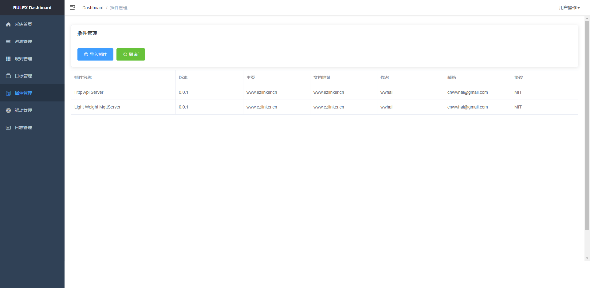

# RULEX

<div style="text-align:center">

</div>

RULEX 是一个被计划用于边缘端的轻量级规则引擎开发框架, 支持多种数据接入以及自定义数据流筛选，可以快速实现边缘端设备的数据处理功能。很适合在网关场景中使用。

## 快速开始
### 构建
```sh
git clone https://github.com/wwhai/rulex.git
cd rulex
make # on windows: make windows
```
> ProtoFile 要在Linux下编译, 需要安装: `sudo apt install protobuf-compiler -y`
## 支持的平台

| 平台    | 架构   | 编译测试 |
| ------- | ------ | -------- |
| Windows | X86-64 | 通过     |
| Linux   | X86-64 | 通过     |
| ARM64   | ARM-64 | 通过     |
| ARM32   | ARM-32 | 通过     |
| MacOS   | X86-64 | 通过     |
| 其他    | 未知   | 未知     |

## 跨平台编译

注意:` Arm32位`下编译比较麻烦, 推荐使用`Ubuntu18-04`安装交叉编译工具进行编译, 具体步骤请参考 `.github\workflows\4_build-arm-32-v7.yml` 里面的脚本。

### 启动

```sh
rulex run
```

## Dashboard
```
浏览器输入：http://127.0.0.1:2580
```
<div style="text-align:center">

</div>
<div style="text-align:center">

</div>
<div style="text-align:center">

</div>
<div style="text-align:center">

</div>
<div style="text-align:center">

</div>

## 规则引擎
### 规则定义
```lua

function Success()
    -- do some things
end

function Failed(error)
    -- do some things
end

Actions = {
    function(data)
        return true, data
    end
}

```

### 数据筛选
```lua
function Success()
    -- do some things
end

function Failed(error)
    -- do some things
end

Actions = {
    function(data)
        print("return => ", rulex:JqSelect(".[] | select(.hum < 20)", data))
        return true, data
    end
}
```
### 数据中转

```lua
function Success()
    -- do some things
end

function Failed(error)
    -- do some things
end

Actions = {
    function(data)
        -- 持久化到 MongoDb:
        rulex:DataToMongo("OUTEND_83775a94-9f64-4d37-be17-45dd0c90f56d", data)
        -- 持久化到 Mysql:
        rulex:DataToMysql("OUTEND_83775a94-9f64-4d37-be17-45dd0c90f56d", data)
        -- 推送化到 Kafka:
        rulex:DataToKafka("OUTEND_83775a94-9f64-4d37-be17-45dd0c90f56d", data)
        return true, data
    end
}
```
### 云端计算
```lua
function Success()
    -- do some things
end

function Failed(error)
    -- do some things
end

Actions = {
    function(data)
        -- PyTorch 训练数据:
        cloud:PyTorchTrainCNN(data)
        -- PyTorch 识别:
        local V = cloud:PyTorchCNN(data)
        print(V)
        return true, data
    end
}
```

## 详细文档

<a href="https://wwhai.github.io/rulex_doc_html">[点我查看详细文档]</a>


## 社区
- QQ群：608382561
- 微信：bignullnull( 加好友后进群, 暗号：RULEX )

    <div style="text-align:center">
    
    </div>

- 博客1：https://wwhai.gitee.io
- 博客2：https://wwhai.github.io